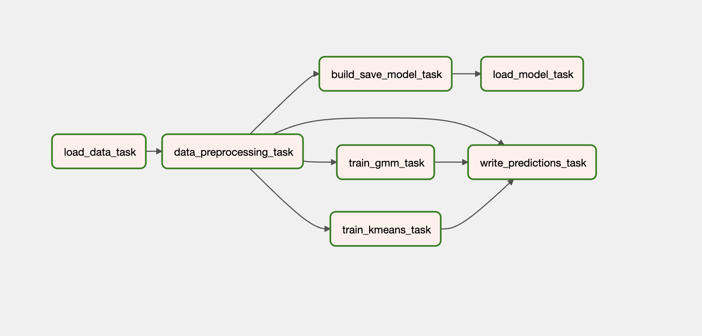
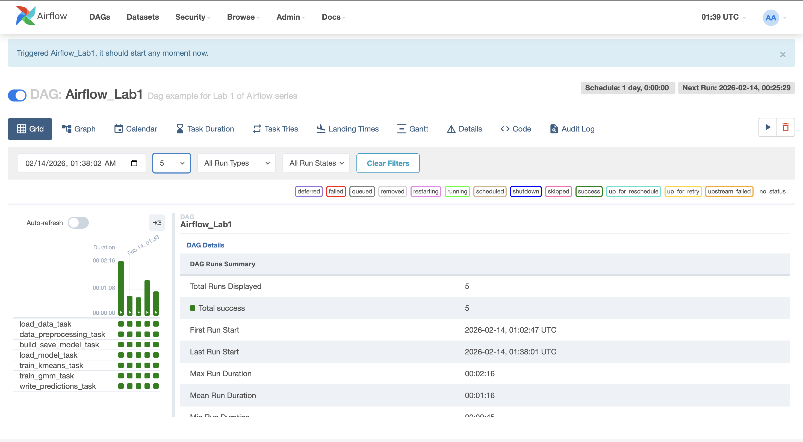

# Airflow Lab 1 (Docker) — KMeans + GMM Clustering Pipeline

This repo contains my Lab 1 Airflow setup using Docker Compose and an Airflow DAG that:
1. Loads credit card customer data from CSV
2. Preprocesses and MinMax-scales selected features
3. Trains **KMeans** and **Gaussian Mixture Model (GMM)** using silhouette score to select the best `k`
4. Saves trained models (`.sav`)
5. Generates a `cluster_predictions.csv` output into `working_data/`

---

## Folder Structure (Relevant)

```
Lab_1/
  dags/
    airflow.py                 # Airflow DAG
    src/
      lab.py                   # ML pipeline functions
  model/                       # saved models (kmeans/gmm)
  working_data/
    cluster_predictions.csv    # predictions output
  data/
    file.csv                   # training data
    test.csv                   # test data
  docker-compose.yaml
  setup.sh
```

---

## What I Changed (My Updates)

### 1) Updated ML pipeline in `dags/src/lab.py`

- **Made XCom payloads JSON-safe** by serializing objects using:
  - `pickle.dumps(...)` → `base64.b64encode(...)` for return values
- Added/updated functions:
  - `load_data()`
    - Loads `data/file.csv`
    - Returns **base64-encoded pickled DataFrame**
  - `data_preprocessing(data_b64)`
    - Decodes base64 → DataFrame
    - Drops nulls
    - Selects features: `["BALANCE", "PURCHASES", "CREDIT_LIMIT"]`
    - Applies **MinMaxScaler**
    - Returns **base64-encoded pickled numpy array**
  - `train_kmeans_best(data_b64, model_filename="kmeans.sav")`
    - Searches `k=2..10`
    - Uses **silhouette score** to pick best `k`
    - Saves best model in `dags/model/`
    - Returns JSON dict: `{model, best_k, silhouette}`
  - `train_gmm_best(data_b64, model_filename="gmm.sav")`
    - Searches `k=2..10`
    - Uses **silhouette score** to pick best `k`
    - Saves best model in `dags/model/`
    - Returns JSON dict: `{model, best_k, silhouette}`
  - `write_predictions_csv(data_b64, kmeans_info, gmm_info, out_csv="cluster_predictions.csv")`
    - Loads saved models
    - Predicts clusters for every row
    - Writes output CSV to: `/opt/airflow/working_data/cluster_predictions.csv`
    - Returns summary dict including path and best-k metrics
- Kept earlier elbow/SSE helper functions (if needed):
  - `build_save_model(...)` and `load_model_elbow(...)`

### 2) Updated DAG in `dags/airflow.py`

- Updated the DAG tasks to run the full pipeline end-to-end using the new functions:
  - Load data → preprocess → train KMeans → train GMM → write predictions CSV
- Passed outputs via XCom using `.output` between tasks (all JSON-safe)

### 3) Outputs Produced

- Saved trained models:
  - `dags/model/kmeans.sav`
  - `dags/model/gmm.sav`
  - (and `dags/model/model.sav` if elbow pipeline task is also included)
- Generated output predictions file:
  - `working_data/cluster_predictions.csv`

---

## How To Run (Step-by-Step)

### Prerequisites

- Docker Desktop installed and running

### 1) Clean setup + initialize environment

From the `Lab_1` directory:

```bash
bash setup.sh
```

This script:
- Removes old `.env`, `logs/`, `plugins/`, `config/`
- Runs `docker compose down -v`
- Recreates required folders
- Writes your UID to `.env` as `AIRFLOW_UID=...`
- Prints airflow config using airflow-cli

### 2) Start Airflow

```bash
docker compose up
```

### 3) Open Airflow UI

Airflow Webserver runs at: [http://localhost:8080](http://localhost:8080)

Login (default):
- **Username:** airflow
- **Password:** airflow

### 4) Trigger the DAG

- In UI, open DAG: **Airflow_Lab1**
- Toggle DAG **ON**
- Click **Run** (▶)

### 5) Verify outputs

After a successful run:
- Models should be present in: `dags/model/`
- Predictions file should be present in: `working_data/cluster_predictions.csv`

---

## Screenshots

### 1) Graph View



### 2) Successful Run



> **Note:** Create a folder named `screenshots/` and place `graph.png` and `success_run.png` inside it.

---

## How To Stop Airflow

Press `Ctrl + C` in the terminal running docker compose, then:

```bash
docker compose down
```

If you want to remove volumes as well:

```bash
docker compose down -v
```

---

## Notes / Troubleshooting

### "AIRFLOW_UID not set" warning

- Running `bash setup.sh` generates `.env` with your UID automatically.
- On Mac, this warning can still appear sometimes, but the stack should run.

### Low memory warning

You may see: *"Not enough memory available for Docker"*

If Airflow still runs and tasks complete. Otherwise, increase Docker Desktop memory (Settings → Resources).

---

## Files Submitted / Included in Repo

- `dags/airflow.py`
- `dags/src/lab.py`
- `dags/model/*.sav`
- `working_data/cluster_predictions.csv`
- `README.md`
- `docker-compose.yaml`
- `setup.sh`